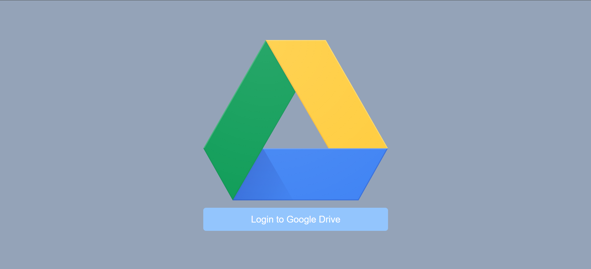
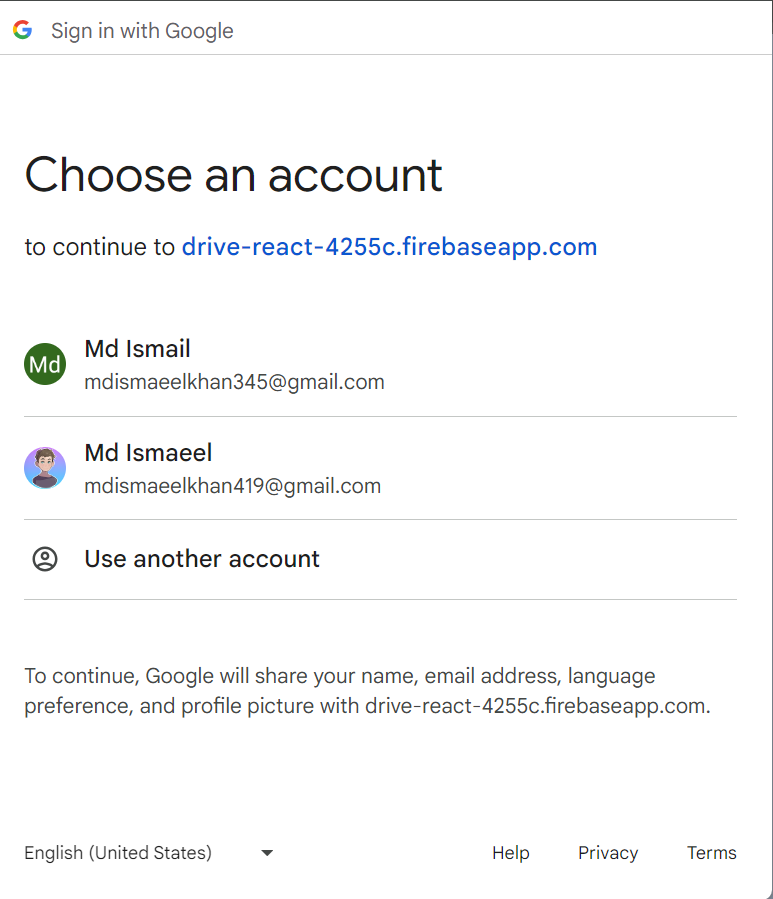
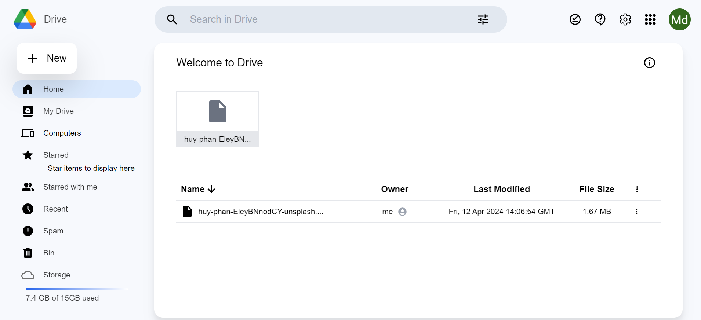
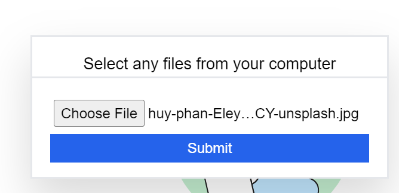
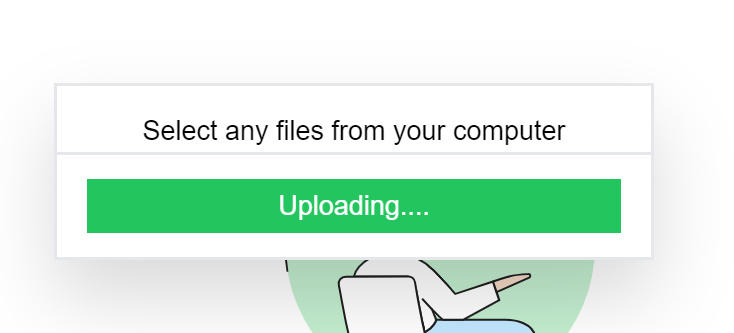
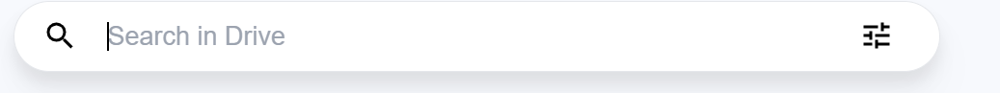
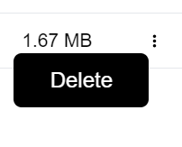

# Google Drive Clone with Firebase Authentication

## Overview
This project aims to create a Google Drive clone application for Redmi devices, integrating Firebase Authentication for user management.

## Features
- User Authentication: Users can sign up, sign in, and sign out securely using Firebase Authentication.
- File Management: Users can upload, download, delete, and organize files and folders.
- Permissions: Implementation of permission management to control access to files based on user roles.

## Technologies Used
- Firebase: For user authentication and real-time database.
- Redmi Firmware: The firmware environment for developing the application.

## Tech. Stack Used:

- [HTML](https://en.wikipedia.org/wiki/HTML)
- [Css](https://en.wikipedia.org/wiki/CSS)
- [JavaScript](https://en.wikipedia.org/wiki/JavaScript)
- [JavScript Es6](https://en.wikipedia.org/wiki/JavaScript)
- [GitHub](https://github.com/)
- [Vs-Code](https://code.visualstudio.com/)
- [React-js](<https://en.wikipedia.org/wiki/React_(JavaScript_library)>)
- [tailwind-css](https://en.wikipedia.org/wiki/Tailwind_CSS)

### initial state where to redirect for login users

### Once user Click to login to google drive it will redirect to dive

### Implemented Ui as similar Google-Drive

### When User will click on add Button then model will open and add any data like video audio image and that will store ion file base

### Here is the popUp model to add file

### One files selected from computer user can click to Upload the data

### When user wants to filter some data by name they can access by giving some input value

### when data has added and if you want to remove from firebase you can delete throw this button

## Installation
1. Clone the repository.
2. Set up Firebase project and obtain necessary credentials.
3. Integrate Firebase SDK into the Redmi firmware project.
4. Follow platform-specific instructions for integrating Firebase Authentication and Realtime Database.

## Usage
1. Build and deploy the Redmi firmware with Firebase integration.
2. Launch the application on Redmi device.
3. Sign up or sign in with a Google account.
4. Access file management functionalities to upload, download, and manage files.
5. Manage permissions to control access to files and folders.

## Development
- Follow best practices for Redmi firmware development.
- Use Firebase documentation for integrating Firebase services.
- Test thoroughly and debug any issues during development.
- Implement security measures to protect user data and application integrity.

## Contributing
Contributions are welcome! Feel free to open issues or pull requests for any improvements or bug fixes.

